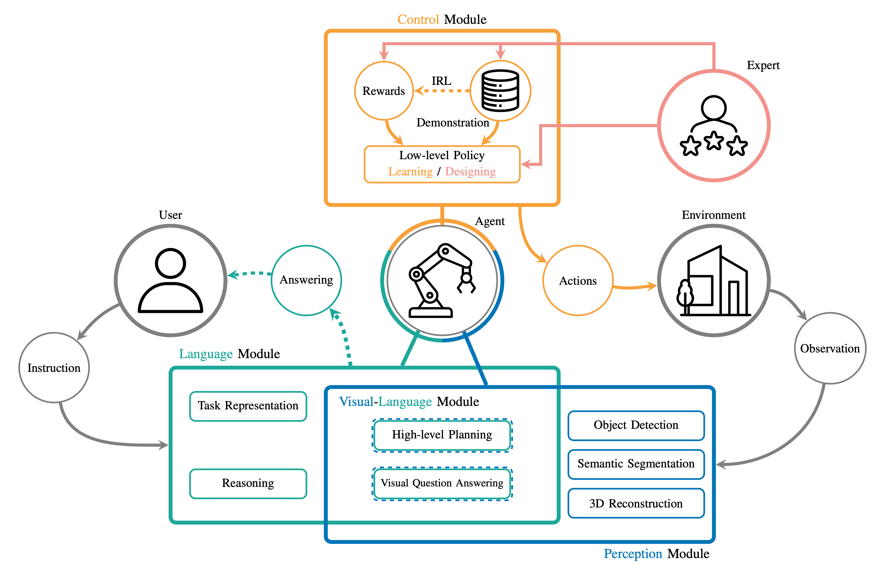

# Thinking Toward Embodied: Awesome Language-conditioned Robot Manipulation Models [](https://github.com/sindresorhus/awesome)



## News
[October 02 2024]  Cutting edge papers in 2024 are avaliable!!!
## Table of the Content

- [Survey Paper](#survey)
- [Language-conditioned Reinforcement Learning](#language-conditioned-reinforcement-learning)
- [Language-conditioned Imitation Learning](#language-conditioned-imitation-learning)
  - [Behaviour Cloning](#behaviour-cloning)
  - [Inverse Reinforcement Learning](#inverse-reinforcement-learning)
- [Neuralsymbolic](#neuralsymbolic)
- [Enpowered by LLMs](#empowered-by-llms)
- [Enpowered by VLMs](#empowered-by-vlms)
- [Comparative Analysis](#comparative-analysis)

## Survey

This paper is basically based on the survey paper

**[Language-conditioned Learning for Robot Manipulation: A Survey](https://arxiv.org/abs/2312.10807)**
<br />
Hongkuan Zhou, 
Xiangtong Yao, 
Oier Mees, 
Yuan Meng, 
Dhruv Shah, 
Ted Xiao,
Yonatan Bisk, 
Edward Johns, 
Mohit Shridhar, 
Kai Huang, 
Zhenshan Bing, 
Alois Knoll
<br />

```bibtex
@article{zhou2023language,
  title={Language-conditioned Learning for Robotic Manipulation: A Survey},
  author={Zhou, Hongkuan and Yao, Xiangtong and Meng, Yuan and Sun, Siming and BIng, Zhenshan and Huang, Kai and Knoll, Alois},
  journal={arXiv preprint arXiv:2312.10807},
  year={2023}
}
```

## Language-conditioned Reinforcement Learning
### Games
- From language to goals: Inverse reinforcement learning for vision-based instruction following [[paper]](https://openreview.net/forum?id=r1lq1hRqYQ)
- Grounding english commands to reward function [[paper]](https://www.roboticsproceedings.org/rss11/p18.pdf)
- Learning to understand goal specifications by modelling reward [[paper]](https://openreview.net/pdf?id=H1xsSjC9Ym)
- Beating atari with natural language guided reinforcement learning [[paper]](https://arxiv.org/abs/1704.05539) [[code]](https://github.com/ishan00/beating-atari-with-natural-language-guided-rl)
- Using natural language for reward shaping in reinforcement learning [[paper]](https://www.ijcai.org/proceedings/2019/331)
### Navigation 
- Gated-attention architectures for task-oriented language grounding [[paper]](https://cdn.aaai.org/ojs/11832/11832-13-15360-1-2-20201228.pdf) [[code]](https://github.com/devendrachaplot/DeepRL-Grounding)
- Mapping instructions and visual observations to actions with reinforcement learning [[paper]](https://aclanthology.org/D17-1106/) 
- Modular multitask reinforcement learning with policy sketches [[paper]](https://dl.acm.org/doi/10.5555/3305381.3305399)
- Representation learning for grounded spatial reasoning [[paper]](https://aclanthology.org/Q18-1004/)
### Manipulation 
- Lancon-learn: Learning with language to enable generalization in multi-task manipulation [[paper]](https://ieeexplore.ieee.org/document/9667188) [[code]](https://github.com/hartikainen/metaworld/tree/reward-tweaks-rebase)
- Pixl2r: Guiding reinforcement learning using natural language by mapping pixels to rewards [[paper]](https://proceedings.mlr.press/v155/goyal21a.html)[[code]](https://github.com/prasoongoyal/PixL2R)
- Learning from symmetry: Meta-reinforcement learning with symmetrical behaviors and language instructions [[paper]](https://arxiv.org/abs/2209.10656)[[website]](https://tumi6robot.wixsite.com/symmetry/) 
- Meta-reinforcement learning via language instructions [[paper]](https://arxiv.org/abs/2209.04924)[[code]](https://github.com/yaoxt3/MILLION)[[website]](https://tumi6robot.wixsite.com/million)
- Learning language-conditioned robot behavior from offline data and crowd-sourced annotation [[paper]](https://proceedings.mlr.press/v164/nair22a/nair22a.pdf) 
- Concept2robot: Learning manipulation concepts from instructions and human demonstrations [[paper]](https://www.roboticsproceedings.org/rss16/p082.pdf) 

## Language-conditioned Imitation Learning
### Behaviour Cloning
- Language conditioned imitation learning over unstructured data [[paper]](https://arxiv.org/abs/2005.07648) [[code]]() [[website]](https://language-play.github.io/)
- Bc-z: Zero-shot task generalization with robotic imitation learning [[paper]](https://arxiv.org/abs/2202.02005) 
- What matters in language-conditioned robotic imitation learning over unstructured data [[paper]](https://arxiv.org/abs/2204.06252) [[code]](https://github.com/lukashermann/hulc)[[website]](http://hulc.cs.uni-freiburg.de/) 
- Grounding language with visual affordances over unstructured data [[paper]](https://arxiv.org/abs/2210.01911) [[code]](https://github.com/mees/hulc2)[[website]](http://hulc2.cs.uni-freiburg.de/)
- Language-conditioned imitation learning with base skill priors under unstructured data [[paper]](https://arxiv.org/abs/2305.19075) [[code]](https://github.com/hk-zh/spil) [[website]](https://hk-zh.github.io/spil/)
- Pay attention!- robustifying a deep visuomotor policy through task-focused visual attention [[paper]](https://arxiv.org/abs/1809.10093)
- Language-conditioned imitation learning for robot manipulation tasks [[paper]](https://arxiv.org/abs/2010.12083)
- Multimodal Diffusion Transformer for Learning from Play [[paper]](https://openreview.net/pdf?id=nvtxqMGpn1)
- Zero-Shot Robotic Manipulation with Pretrained Image-Editing Diffusion Models [[paper]](https://arxiv.org/pdf/2310.10639) [[code]](https://github.com/kvablack/susie) [[website]](https://rail-berkeley.github.io/susie/)
- PlayFusion: Skill Acquisition via Diffusion from Language-Annotated Play [[paper]](https://arxiv.org/pdf/2312.04549) [[website]](https://play-fusion.github.io/)
- ChainedDiffuser: Unifying Trajectory Diffusion and Keypose Prediction for Robotic Manipulation [[paper]](https://openreview.net/pdf?id=W0zgY2mBTA8) [[code]](https://github.com/zhouxian/act3d-chained-diffuser) [[website]](https://github.com/zhouxian/act3d-chained-diffuser)
- GNFactor: Multi-Task Real Robot Learning with Generalizable Neural Feature Fields [[paper]](https://arxiv.org/pdf/2308.16891) [[code]](https://github.com/YanjieZe/GNFactor) [[website]](https://yanjieze.com/GNFactor/)
- DNAct: Diffusion Guided Multi-Task 3D Policy Learning [[paper]](https://arxiv.org/pdf/2403.04115) [[website]](https://dnact.github.io/)
- 3D Diffuser Actor: Policy Diffusion with 3D Scene Representations [[paper]](https://arxiv.org/pdf/2402.10885) [[code]](https://github.com/nickgkan/3d_diffuser_actor) [[website]](https://3d-diffuser-actor.github.io/)
- Vision-Language Foundation Models as Effective Robot Imitators [[paper]](https://arxiv.org/pdf/2311.01378)
- OpenVLA:An Open-Source Vision-Language-Action Model [[paper]](https://arxiv.org/pdf/2406.09246) [[code]](https://github.com/openvla/openvla) [[website]](https://openvla.github.io/)
- Open X-Embodiment: Robotic Learning Datasets and RT-X Models [[paper]](https://arxiv.org/pdf/2310.08864)
- 3D-VLA: A 3D Vision-Language-Action Generative World Model [[paper]](https://openreview.net/pdf?id=EZcFK8HupF) [[code]](https://github.com/UMass-Foundation-Model/3D-VLA) [[website]](https://vis-www.cs.umass.edu/3dvla/)
- Octo: An Open-Source Generalist Robot Policy [[paper]](https://arxiv.org/pdf/2405.12213) [[code]](https://github.com/octo-models/octo) [[website]](https://octo-models.github.io/)

### Inverse Reinforcement Learning
- Grounding english commands to reward function [[paper]](https://www.roboticsproceedings.org/rss11/p18.pdf)
- From language to goals: Inverse reinforcement learning for vision-based instruction following [[paper]](https://arxiv.org/abs/1902.07742)

## Neuralsymbolic
### Learning for Reasoning
- Hierarchical understanding in robotic manipulation: A knowledge-based framework [[paper]](https://www.mdpi.com/2076-0825/13/1/28)
- Semantic Grasping Via a Knowledge Graph of Robotic Manipulation: A Graph Representation Learning Approach [[paper]](https://ieeexplore.ieee.org/iel7/7083369/7339444/09830861.pdf)
- Knowledge Acquisition and Completion for Long-Term Human-Robot Interactions using Knowledge Graph Embedding [[paper]](https://arxiv.org/pdf/2301.06834)
### Reasoning for Learning
- Tell me dave: Context-sensitive grounding of natural language to manipulation instructions [[paper]](https://www.semanticscholar.org/paper/Tell-me-Dave%3A-Context-sensitive-grounding-of-to-Misra-Sung/8cb52a0424992807dceeaf2af740364b2e80c438)
- Neuro-symbolic procedural planning with commonsense prompting [[paper]](https://arxiv.org/abs/2206.02928)
- Reinforcement Learning Based Navigation with Semantic Knowledge of Indoor Environments [[paper]](https://ieeexplore.ieee.org/abstract/document/8919366/?casa_token=7x7LciTVSGYAAAAA:Ou51YDO9Zz6Ozk_7XTjvhdlW2IL5gOv8g9XK5tlrTOLvE2bRsuZvD2E7MRSCyIZ4c2zm-EvDJSI)
- Learning Neuro-Symbolic Skills for Bilevel Planning [[paper]](Learning Neuro-Symbolic Skills for Bilevel Planning)
### Learning-Reasoning
- Learning Neuro-symbolic Programs for Language Guided Robot Manipulation [[paper]](https://arxiv.org/abs/2211.06652) [[code]](https://github.com/dair-iitd/nsrmp) [[website]](https://nsrmp.github.io/)
- Long-term robot manipulation task planning with scene graph and semantic knowledge [[paper]](https://www.emerald.com/insight/content/doi/10.1108/RIA-09-2022-0226/full/html)
## Empowered by LLMs
### Planning
- Sayplan: Grounding large language models using 3d scene graphs for scalable task planning [[paper]](https://arxiv.org/abs/2307.06135)
- Language models as zero-shot planners: Extracting actionable knowledge for embodied agents [[paper]](https://arxiv.org/abs/2201.07207)
- Describe, explain, plan and select: Interactive planning with large language models enables open-world multi-task agents [[paper]](https://arxiv.org/abs/2302.01560)
- Progprompt: Generating situated robot task plans using large language models [[paper]](https://arxiv.org/abs/2209.11302)
- Robots that ask for help: Uncertainty alignment for large language model planners [[paper]](https://arxiv.org/abs/2307.01928)
- Task and motion planning with large language models for object rearrangement [[paper]](https://arxiv.org/abs/2303.06247)
- Do as i can, not as i say: Grounding language in robotic affordances [[paper]](https://arxiv.org/abs/2204.01691)
- The 2014 international planning competition: Progress and trends [[paper]](https://ojs.aaai.org/aimagazine/index.php/aimagazine/article/view/2571)
- Robot task planning via deep reinforcement learning: a tabletop object sorting application [[paper]](https://ieeexplore.ieee.org/document/8914278)
- Robot task planning and situation handling in open worlds [[paper]](https://arxiv.org/abs/2210.01287) [[code]](https://github.com/yding25/GPT-Planner) [[website]](https://cowplanning.github.io/)
- Embodied Task Planning with Large Language Models [[paper]](https://arxiv.org/abs/2307.01848) [[code]](https://github.com/Gary3410/TaPA) [[website]](https://gary3410.github.io/TaPA/)
- Text2motion: From natural language instructions to feasible plans [[paper]](https://arxiv.org/abs/2303.12153) [[website]](https://sites.google.com/stanford.edu/text2motion)
- Large language models as commonsense knowledge for large-scale task planning [[paper]](https://arxiv.org/abs/2305.14078) [[code]](https://github.com/1989Ryan/llm-mcts) [[website]](https://llm-mcts.github.io/)
- Alphablock: Embodied finetuning for vision-language reasoning in robot manipulation [[paper]](https://arxiv.org/abs/2305.18898) 
- Learning to reason over scene graphs: a case study of finetuning gpt-2 into a robot language model for grounded task planning [[paper]](https://www.frontiersin.org/articles/10.3389/frobt.2023.1221739/full) [[code]](https://github.com/dnandha/RobLM)
- Scaling up and distilling down: Language-guided robot skill acquisition [[paper]](https://arxiv.org/abs/2307.14535)[[code]](https://github.com/real-stanford/scalingup) [[website]](https://www.cs.columbia.edu/~huy/scalingup/)
- Stap: Sequencing task-agnostic policies [[paper]](https://ieeexplore.ieee.org/document/10160220) [[code]](https://github.com/agiachris/STAP)[[website]](https://sites.google.com/stanford.edu/stap/home)
- Inner monologue: Embodied reasoning through planning with language models [[paper]](https://arxiv.org/abs/2207.05608) [[website]](https://innermonologue.github.io/) 
### Reasoning
- Rearrangement:A challenge for embodied ai [[paper]](https://arxiv.org/abs/2011.01975)
- The threedworld transport challenge: A visually guided task and motion planning benchmark for physically realistic embodied ai [[paper]](https://ieeexplore.ieee.org/document/9812329) 
- Tidy up my room: Multi-agent cooperation for service tasks in smart environments [[paper]](https://dl.acm.org/doi/abs/10.3233/AIS-190524) 
- A quantifiable stratification strategy for tidy-up in service robotics [[paper]](https://ieeexplore.ieee.org/document/9542842)
- Tidybot: Personalized robot assistance with large language models [[paper]](https://arxiv.org/abs/2305.05658)
- Housekeep: Tidying virtual households using commonsense reasoning [[paper]](https://arxiv.org/abs/2205.10712)
- Building cooperative embodied agents modularly with large language models [[paper]](https://arxiv.org/abs/2307.02485)
- Socratic models: Composing zero-shot multimodal reasoning with language [[paper]](https://arxiv.org/abs/2204.00598)
- Voyager: An open-ended embodied agent with large language models [[paper]](https://arxiv.org/abs/2305.16291)
- Translating natural language to planning goals with large-language models [[paper]](https://arxiv.org/abs/2302.05128)
## Empowered by VLMs
- Cliport: What and where pathways for robotic manipulation [[paper]](https://arxiv.org/abs/2109.12098) [[code]](https://github.com/cliport/cliport) [[website]](https://cliport.github.io/)
- Transporter networks: Rearranging the visual world for robotic manipulation [[paper]](https://proceedings.mlr.press/v155/zeng21a/zeng21a.pdf) [[code]](https://github.com/google-research/ravens) [[website]](https://transporternets.github.io/)
- Simple but effective: Clip embeddings for embodied ai [[paper]](https://openaccess.thecvf.com/content/CVPR2022/papers/Khandelwal_Simple_but_Effective_CLIP_Embeddings_for_Embodied_AI_CVPR_2022_paper.pdf) 
- Instruct2act: Mapping multi-modality instructions to robotic actions with large language model [[paper]](https://arxiv.org/abs/2305.11176) [[code]](https://github.com/OpenGVLab/Instruct2Act)
- Latte: Language trajectory transformer [[paper]](https://arxiv.org/abs/2208.02918) [[code]](https://github.com/arthurfenderbucker/LaTTe-Language-Trajectory-TransformEr)
- Embodied Task Planning with Large Language Models [[paper]](https://arxiv.org/abs/2307.01848) [[code]](https://github.com/Gary3410/TaPA) [[website]](https://gary3410.github.io/TaPA/)
- Palm-e: An embodied multimodal language model [[paper]](https://arxiv.org/abs/2303.03378)  [[website]](https://palm-e.github.io/)
- Socratic models: Composing zero-shot multimodal reasoning with language [[paper]](https://arxiv.org/abs/2204.00598)
- Pretrained language models as visual planners for human assistance [[paper]](https://openaccess.thecvf.com/content/ICCV2023/papers/Patel_Pretrained_Language_Models_as_Visual_Planners_for_Human_Assistance_ICCV_2023_paper.pdf) [[code]](https://github.com/facebookresearch/vlamp)
- Open-world object manipulation using pre-trained vision-language models [[paper]](https://arxiv.org/abs/2303.00905) [[website]](https://robot-moo.github.io/)
- Robotic skill acquisition via instruction augmentation with vision-language models [[paper]](https://arxiv.org/abs/2211.11736) [[website]](https://instructionaugmentation.github.io/)
- Language reward modulation for pretraining reinforcement learning [[paper]](https://arxiv.org/abs/2308.12270) [[code]](https://github.com/ademiadeniji/lamp)
- Vision-language models as success detectors [[paper]](https://proceedings.mlr.press/v232/du23b.html)

## Comparative Analysis
### Simulator
| Simulator | Description |
| - | - |
| [PyBullet](https://pybullet.org/wordpress/) | <div style="width: 350pt">With its origins rooted in the Bullet physics engine, PyBullet transcends the boundaries of conventional simulation platforms, offering a wealth of tools and resources for tasks ranging from robot manipulation and locomotion to computer-aided design analysis.</div> | <div style="width: 250pt"> Shao et al., Mees et al.  leverage pybullet to build a table-top environment to conduct object manipulations tasks. </div>|
| [MuJoCo](https://mujoco.org/) | <div style="width: 350pt"> MuJoCo, short for "Multi-Joint dynamics with Contact", originates from the vision of creating a physics engine tailored for simulating articulated and deformable bodies. It has evolved into an essential tool for exploring diverse domains, from robot locomotion and manipulation to human movement and control. </div>|
| [CoppeliaSim](https://www.coppeliarobotics.com/) | <div style="width: 350pt"> CoppeliaSim is formerly known as V-REP (Virtual Robot Experimentation Platform). It offers a comprehensive environment for simulating and prototyping robotic systems, enabling users to create, analyze, and optimize a wide spectrum of robotic applications. Its origins as an educational tool have evolved into a full-fledged simulation framework, revered for its versatility and user-friendly interface. </div>|
| [NVIDIA Omniverse](https://www.nvidia.com/en-us/omniverse/) | <div style="width: 350pt"> NVIDIA Omniverse offers real-time physics simulation and lifelike rendering, creating a virtual environment for comprehensive testing and fine-tuning of robotic manipulation algorithms and control strategies, all prior to their actual deployment in the physical realm. </div>|
| [Unity](https://unity.com/) | <div style="width: 350pt"> Unity is a cross-platform game engine developed by Unity Technologies. Renowned for its user-friendly interface and powerful capabilities, Unity has become a cornerstone in the worlds of video games, augmented reality (AR), virtual reality (VR), and also simulations. </div>| 

### Benchmarks
<table>
    <tr align="center">
        <th rowspan="2" >Benchmark</th>
        <th rowspan="2">Simulation Engine</th>
        <th rowspan="2">Manipulator</th>
        <td colspan="3"> <b> Observation</td>
        <th rowspan="2">Tool used</th>
        <th rowspan="2">Multi-agents</th>
        <th rowspan="2">Long-horizon</th>
    </tr>
    <tr>
        <th>RGB</th>
        <th>Depth</th>
        <th>Masks</th>
    </tr>
    <tr align="center">
        <td><a href="http://calvin.cs.uni-freiburg.de/">CALVIN</a></td>
        <td>PyBullet</td>
        <td>Franka Panda</td>
        <td>✅</td>
        <td>✅</td>
        <td>❌</td>
        <td>❌</td>
        <td>❌</td>
        <td>✅</td>
    </tr>
    <tr align="center">
        <td><a href="https://meta-world.github.io/">Meta-world</a></td>
        <td>MuJoCo</td>
        <td>Sawyer</td>
        <td>✅</td>
        <td>❌</td>
        <td>❌</td>
        <td>❌</td>
        <td>❌</td>
        <td>❌</td>
    </tr>
    <tr align="center">
        <td><a href="https://arxiv.org/abs/2308.00937">LEMMA</a></td>
        <td>NVIDIA Omniverse</td>
        <td>UR10 & UR5</td>
        <td>✅</td>
        <td>✅</td>
        <td>❌</td>
        <td>✅</td>
        <td>✅</td>
        <td>✅</td>
    </tr>
    <tr align="center">
        <td><a href="https://github.com/stepjam/RLBench">RLbench</a></td>
        <td>CoppeliaSim</td>
        <td>Franka Panda</td>
        <td>✅</td>
        <td>✅</td>
        <td>✅</td>
        <td>❌</td>
        <td>❌</td>
        <td>✅</td>
    </tr>
    <tr align="center">
        <td><a href="https://github.com/vimalabs/VIMABench">VIMAbench</a></td>
        <td>Pybullet</td>
        <td>UR5</td>
        <td>✅</td>
        <td>❌</td>
        <td>❌</td>
        <td>❌</td>
        <td>❌</td>
        <td>✅</td>
    </tr>
    <tr align="center">
        <td><a href="https://cisnlp.github.io/lohoravens-webpage/">LoHoRavens</a></td>
        <td>Pybullet</td>
        <td>UR5</td>
        <td>✅</td>
        <td>✅</td>
        <td>❌</td>
        <td>❌</td>
        <td>❌</td>
        <td>✅</td>
    </tr>
    <tr align="center">
        <td><a href="https://arnold-benchmark.github.io/">ARNOLD</a></td>
        <td>NVIDIA Isaac Gym</td>
        <td>Franka Panda</td>
        <td>✅</td>
        <td>✅</td>
        <td>✅</td>
        <td>❌</td>
        <td>❌</td>
        <td>✅</td>
    </tr>
</table>


### Models
| Model | Year | Benchmark | Simulation Engine | Language Module| Perception Module | Real World Experiment | LLM | Reinforcement Learning | Imitation Learning |
| ------ | ------ | :-----------: | :-: | :-: | :-: | :-: | :-: | :-: | :-: |
|  [DREAMCELL](https://arxiv.org/abs/1903.08309) |  2019  |        #         | -       | LSTM | *   | ❌ | ❌ | ❌ | ✅ |
|  [PixL2R](https://proceedings.mlr.press/v155/goyal21a.html) |  2020  |    Meta-World    | MuJoCo  | LSTM | CNN | ❌ | ❌ | ✅ | ❌ |
| [Concept2Robot](https://www.roboticsproceedings.org/rss16/p082.pdf) | 2020 | # | PyBullet | BERT | ResNet-18 | ❌ | ❌ | ❌ | ✅ |
| [LanguagePolicy](https://proceedings.neurips.cc/paper/2020/hash/9909794d52985cbc5d95c26e31125d1a-Abstract.html) | 2020 | # | CoppeliaSim | GLoVe | Faster RCNN | ❌ | ❌ | ❌ | ✅ |
| [LOReL](https://proceedings.mlr.press/v164/nair22a.html)| 2021 | Meta-World | MuJoCo | distillBERT | CNN | ✅ | ❌ | ❌ | ✅ |
| [CARE](https://proceedings.mlr.press/v139/sodhani21a.html) | 2021 | Meta-World | MuJoCo | RoBERTa | * | ❌ | ✅ | ✅ | ❌ |
| [MCIL](https://arxiv.org/abs/2005.07648) | 2021 | # | MuJoCo | MUSE | CNN | ❌ | ❌ | ❌ | ✅ |
| [BC-Z](https://arxiv.org/abs/2202.02005) | 2021 | # | - | MUSE | ResNet18 | ✅ | ❌ | ❌ | ✅ |
| [CLIPort](https://proceedings.mlr.press/v164/shridhar22a.html) | 2021 | # | Pybullet | CLIP | CLIP/ResNet | ✅ | ❌ | ❌ | ✅ |
| [LanCon-Learn](https://ieeexplore.ieee.org/document/9667188) | 2022 | Meta-World | MuJoCo | GLoVe | * | ❌ | ❌ | ✅ | ✅ | 
| [MILLON](https://arxiv.org/abs/2209.04924) | 2022 | Meta-World| MuJoCo | GLoVe | * | ✅ | ❌ | ✅ | ❌ | 
| [PaLM-SayCan](https://arxiv.org/abs/2204.01691) | 2022 | # | - | PaLM | ViLD | ✅ | ✅ | ✅ | ✅ |
| [ATLA](https://arxiv.org/abs/2206.13074) | 2022 | # | PyBullet | BERT-Tiny | CNN | ❌ | ✅ | ✅ | ❌ |
| [HULC](https://arxiv.org/abs/2204.06252) | 2022 | CALVIN | Pybullet | MiniLM-L3-v2 | CNN | ❌ | ❌ | ❌ | ✅ |
| [PerAct](https://arxiv.org/abs/2209.05451) | 2022 | RLbench | CoppelaSim | CLIP | ViT | ✅ | ❌ | ❌ | ✅ |
| [RT-1](https://arxiv.org/abs/2212.06817) | 2022 | # | - | USE | EfficientNet-B3 |  ✅ | ✅ | ❌ | ❌ |
| [LATTE](https://arxiv.org/abs/2208.02918) | 2023 | # | CoppeliaSim | distillBERT, CLIP | CLIP | ✅ | ❌ |  ❌ | ❌ |
| [DIAL](https://arxiv.org/abs/2211.11736) | 2022 | # | - | CLIP | CLIP |  ✅ | ✅ | ❌ | ✅ |
| [R3M](https://arxiv.org/abs/2203.12601) | 2022 | # | - | distillBERT | ResNet | ✅ | ❌ | ❌ | ✅ |
| [Inner Monologue](https://arxiv.org/abs/2207.05608) | 2022 | # | - | CLIP | CLIP | ✅ | ✅ | ❌ | ❌ |
| [NLMap](https://ieeexplore.ieee.org/document/10161534) | 2023 | # | - | CLIP | ViLD | ✅ | ✅ | ❌ | ✅ |
| [Code as Policies](https://ieeexplore.ieee.org/document/10160591) | 2023 | # | - | GPT3, Codex | ViLD | ✅ | ✅ | ❌ | ❌ | 
| [PROGPROMPT](https://arxiv.org/abs/2209.11302) |  2023 | Virtualhome | Unity3D | GPT-3 | * | ✅ | ✅ | ❌ | ❌ |
| [Language2Reward](https://arxiv.org/abs/2306.08647) | 2023 | # | MuJoCo MPC | GPT-4 | * | ✅ | ✅ | ✅ | ❌ |
| [LfS](https://arxiv.org/abs/2209.10656) | 2023 | Meta-World | MuJoCo | Cons. Parser | * | ✅ | ❌ | ✅ | ❌ |
| [HULC++](https://arxiv.org/abs/2210.01911)| 2023 | CALVIN | PyBullet | MiniLM-L3-v2 | CNN | ✅ | ❌ | ❌ | ✅ |
| [LEMMA](https://arxiv.org/abs/2308.00937) | 2023 | LEMMA | NVIDIA Omniverse | CLIP | CLIP | ❌ | ❌ | ❌ | ✅ |
| [SPIL](https://arxiv.org/abs/2305.19075)| 2023 | CALVIN | PyBullet | MiniLM-L3-v2 | CNN | ✅ | ❌ | ❌ | ✅ |
| [PaLM-E](https://proceedings.mlr.press/v202/driess23a.html) | 2023 | # | PyBullet | PaLM | ViT | ✅ | ✅ | ❌ | ✅ | 
| [LAMP](https://arxiv.org/abs/2308.12270) | 2023 | RLbench | CoppelaSim  | ChatGPT | R3M | ❌ | ✅ | ✅ | ❌ |
| [MOO](https://arxiv.org/abs/2303.00905) | 2023 | # | - | OWL-ViT | OWL-ViT | ✅ | ❌ | ❌ | ✅ |
| [Instruction2Act](https://arxiv.org/abs/2305.11176) | 2023 | VIMAbench | PyBullet | ChatGPT | CLIP | ❌ | ✅ |  ❌ | ❌ |
| [VoxPoser](https://arxiv.org/abs/2307.05973) | 2023 | # | SAPIEN | CPT-4 | OWL-ViT  | ✅ | ✅ | ❌ | ❌| 
| [SuccessVQA](https://arxiv.org/abs/2303.07280) | 2023 | # | IA Playroom | Flamingo | Flamingo | ✅ | ✅ | ❌ | ❌| 
| [VIMA](https://arxiv.org/abs/2210.03094) | 2023 | VIMAbench | PyBullet | T5 model | ViT | ✅ | ✅ | ❌ | ✅| 
| [TidyBot](https://arxiv.org/abs/2305.05658) | 2023 | # | - | GPT-3 | CLIP | ✅ | ✅ | ❌ | ❌| 
| [Text2Motion](https://arxiv.org/abs/2303.12153) | 2023 | # | - | GPT-3, Codex | * | ✅ | ✅ | ✅ | ❌| 
| [LLM-GROP](https://arxiv.org/abs/2303.06247) | 2023 | # | Gazebo | GPT-3 | * | ✅ | ✅ | ❌ | ❌| 
| [Scaling Up](https://arxiv.org/abs/2307.14535) | 2023 | # | MuJoCo | CLIP, GPT-3 | ResNet-18 | ✅ | ✅ | ❌ | ✅ | 
| [Socratic Models](https://openreview.net/pdf?id=kdHpWogtX6Y) | 2023 | # | - | RoBERTa, GPT-3 | CLIP | ✅ | ✅ | ❌ | ❌| 
| [SayPlan](https://arxiv.org/abs/2307.06135) | 2023 | # | - | GPT-4 | * | ✅ | ✅ | ❌ | ❌ | 
| [RT-2](https://arxiv.org/abs/2307.15818) | 2023 | # | - | PaLI-X, PaLM-E | PaLI-X, PaLM-E | ✅ | ✅ | ❌ | ❌ | 
| [KNOWNO](https://arxiv.org/abs/2307.01928) | 2023 | # | PyBullet | PaLM-2L | * | ✅ | ✅ | ❌ | ❌ | 
| [Diffusion Policy](https://arxiv.org/abs/2303.04137) |2023| Push-T | MuJoCo| - | CNN |  ✅ | ❌ | ❌ | ✅ |
| [MDT](https://arxiv.org/html/2407.05996v1) | 2023 | CALVIN | PyBullet | CLIP | CLIP | ❌ | ❌ | ✅ | ✅ |
| [Scaling Up](https://arxiv.org/abs/2307.14535) | 2023 | # | MuJoCo| CLIP | CLIP | ✅ | ❌ | ❌ | ✅ |
| [Playfussion](https://arxiv.org/abs/2312.04549) | 2023 | CALVIN | PyBullet | Sentence-BERT | ResNet-18 | ✅ | ❌ | ❌ | ✅ |
| [ChainedDiffuer](https://proceedings.mlr.press/v229/xian23a.html) | 2023 | RLbench | CoppelaSim | CLIP | CLIP | ✅ | ❌ | ❌ | ✅ |
| [GNFactor](https://arxiv.org/abs/2308.16891) | 2023 | RLbench | CoppelaSIm | CLIP | NeRF | ✅ | ❌ | ❌ | ✅ |
| [DNAct](https://arxiv.org/abs/2403.04115) | 2024 | RLbench | CoppelaSim | CLIP | NeRF, PointNext | ✅ | ❌ | ❌ | ✅ |
| [3D Diffuser Actor](https://arxiv.org/abs/2402.10885) | 2024 | CALVIN | PyBullet | CLIP | CLIP | ✅ | ❌ | ❌ | ✅ |
| [RoboFlamingo](https://arxiv.org/abs/2311.01378) | 2024 | CALVIN | PyBullet | OpenFlamingo | OpenFlamingo | ❌ | ✅ | ❌ | ✅ |
| [OpenVLA](https://arxiv.org/abs/2406.09246) | 2024 | Open X-Embodiment | - | Llama 2 7B | DinoV2 & SigLIP |  ✅ | ✅ | ❌ | ✅ | 
| [RT-X](https://arxiv.org/abs/2310.08864) | 2024 | Open X-Embodiment | - | PaLi-X/PaLM-E | PaLi-X/PaLM-E | ✅ | ✅ | ❌ | ✅ | 
| [PIVOT](https://openreview.net/forum?id=051jaf8MQy) | 2024 | Open X-Embodiment | - | GPT-4/Gemini | GPT-4/Gemini | ✅ | ✅ | ❌ | ❌ | 
| [3D-VLA](https://openreview.net/forum?id=EZcFK8HupF) | 2024 | RL-Bench & CALVIN | CoppeliaSim & PyBullet | 3D-LLM | 3D-LLM | ❌ | ✅ | ❌ | ✅ |
| [Octo](https://arxiv.org/abs/2405.12213) | 2024 | Open X-Embodiment | - | T5 | CNN | ✅ | ✅ | ❌ | ✅ | 
| [ECoT](https://arxiv.org/abs/2407.08693) | 2024 | BridgeData V2 | - | Llama 2 7B | DinoV2 & SigLIP | ✅ | ✅ | ❌ | ✅ | 


